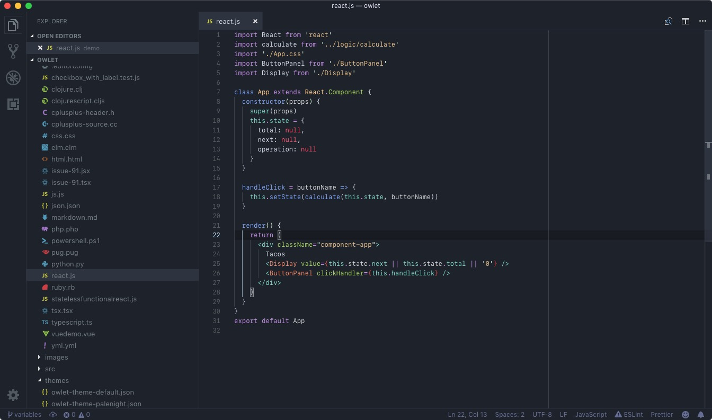
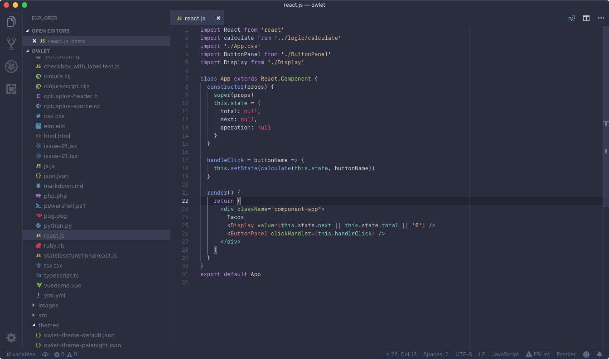
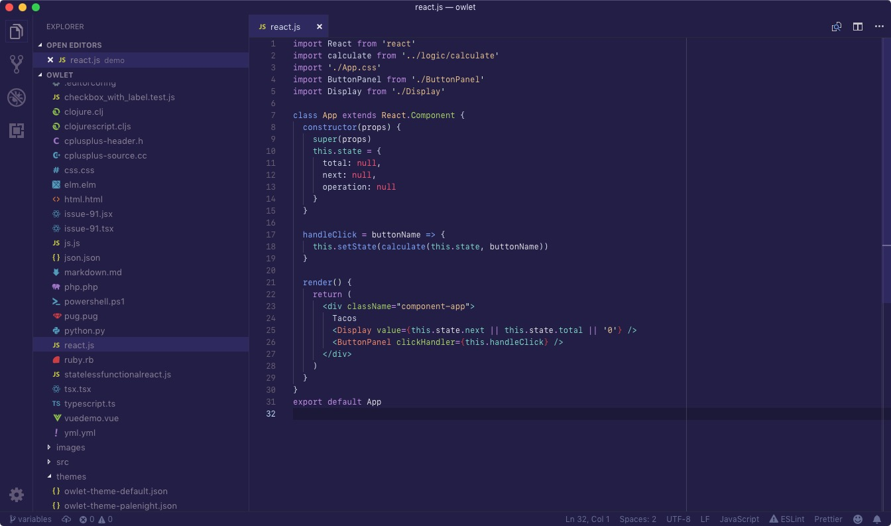

# 🦉 Owlet

[](https://marketplace.visualstudio.com/items?itemName=itsjonq.owlet)

> A simple VSCode Theme, inspired by Night Owl

## Simple

Sarah's (gorgeous) [Night Owl](https://github.com/sdras/night-owl-vscode-theme) is 90%+ perfect for me! There are just a couple of things that I wanted to adjust.
I've ~wasted~ spent many hours tweaking and [generating iTerm and Vim](https://github.com/ItsJonQ/base16-builder) themes. From this, I've learned that the easiest way (for me) to make fine-tune adjustments would be to distill the colour palette down to as few variables as possible.

Owlet's palette looks like this:

```js
const shades = {
  background: "#1e222a",
  dark: "#141820",
  light: "#2d3139",
  lighter: "#3c4048",
  text: "#737e83",
  textLight: "#cad3e8",
  textDark: "#555a6f",
  border: "#ffffff11",
  borderLight: "#ffffff33"
};
```

I'll most likely continue to simplify and adjust as time passes. Using something like the [color](https://www.npmjs.com/package/color), I'll probably be able to achieve this with a single hex color value, leveraging the `lighten` and `darken` methods to generate the other shades.

## Preview

### Default



### Palenight



### Purple



## Development

This project only has a couple of dependencies, which it uses to generate the VS Code `theme.json` files.

To install the dependencies, run:

```
npm install
```

To build the theme file(s), run:

```
npm start
```

### Theme files

An Owlet theme only really requires a single shade, which makes up the background.

**Example**

```js
// themes/palenight.js
const colors = require("../colors/default");

const config = {
  name: "Owlet (Palenight)",
  type: "dark"
};

const shades = {
  background: "#292d3e"
};

module.exports = {
  config,
  shades,
  colors
};
```

The theme is genearted into `/themes/`, with it's details added to `package.json` - ready for publishing!
